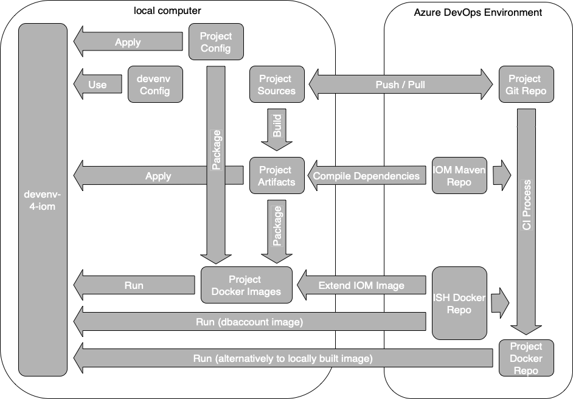

# Azure DevOps Integration

## Overview

The figure below shows the relations between *devenv-4-iom*, an IOM-project and the *Azure DevOps Environment*, which is part of the *Intershop Commerce Platform*. The *Azure DevOps Environment* provides build-artifacts (by *IOM Maven Repo*) and the IOM Docker-images (by *ISH Docker Repo*). Both are required by the build process of IOM-projects.

Additionally, the *Azure DevOps Environment* provides project specific Docker images (by *Project Docker Repo*), which are used by *devenv-4-iom* to run the IOM project locally.

## Get Access to IOM Maven Repository

When creating a new IOM-project, the project will be tied to a certain *Azure DevOps Environment* (see [Documentation of *IOM Project Archetype*](https://github.com/intershop/iom-project-archetype/blob/main/README.md)).

The URL of the *IOM Maven Repository* (*IOM Maven repo* in the figure above) that provides the IOM build artifacts (//repositories/repository[id='iom-maven-artifacts']/url in *pom.xml*) is specific for each *Azure DevOps Environment*. In order to build the IOM-project locally, the local computer needs to have read-access to the *IOM Maven Repository* too.

To get access to the *IOM Maven Repository*, the file *~/.m2/settings.xml* has to be created or modified if it already exists. This file will contain the credentials for the access to the *IOM Maven Repository*. The *Azure DevOps Environment* provides all the necessary information to setup *~/.m2/settings.xml*. Just follow these steps:

1. Log in to *Azure DevOps Environment*.
2. On the menu to the left, open *Artifacts*.
3. Select feed *iom-maven-artifacts*.
4. Click *Connect to Feed*.
5. Select *Maven*.
6. Follow the instruction *Add or Edit settings.xml ...*. Remember creating a *Personal Access Token* and putting it into *~/.m2/settings.xml* too.

## Get Access to *Intershop Docker Repository*

The *Intershop Docker Repository* (*ISH Docker Repo* in the figure above) provides the Standard IOM Docker images. These Standard IOM Docker images have two purposes:
* The IOM Docker image will be extended by the IOM-project with project specific customizations and configurations. Hence, when building the IOM project locally, read access to the *Intershop Docker Repository* is required.
* The IOM dbaccount image is required to run the IOM project locally within *devenv-4-iom*. This image serves as an initialization image, that is preparing the database account.

Hence, read access to *Intershop Docker Repository* is required for building the IOM project *and* for running it in *devenv-4-iom*. Both types of usage are requiring different methods to provide this access.

### Get *CLI secret*

In both cases the *CLI secret* is required. To get the *CLI secret*, follow these steps:

1. Open [docker.tools.intershop.com](https://docker.tools.intershop.com) in the browser.
2. Log in with *LOGIN VIA OIDC PROVIDER* and use your Intershop Azure account.
3. Select *User Profile* at the top left of the page.
4. In the dialog that appears, copy the CLI secret.

In order to build the IOM project locally, log in to *docker.tools.intershop.com* using your Intershop Azure account and the CLI secret:

    docker login docker.tools.intershop.com

### Create Kubernetes secret *intershop-pull-secret*

For running the IOM project in *devenv-4-iom*, an *image pull secret* (Kubernetes secret object) has to be created for *docker.tools.intershop.com*. The *image pull secret* has to be created within the default namespace of Kubernetes.

    kubectl create secret docker-registry intershop-pull-secret \
      --context="docker-desktop" \
      --namespace=default \
      --docker-server=docker.tools.intershop.com \
      --docker-username='<your Intershop Azure account>' \
      --docker-password='<CLI secret, see above>'

### Add the pull-secret *intershop-pull-secret* to configuration of devenv-4-iom

Finally, the name of the newly created Kubernetes secret has to be passed to *devenv-4-iom*. To do so, set the key *IMAGE_PULL_SECRET* within the user-specific configuration file of *devenv-4-iom* (devenv.user.properties):

    # change into the root directory of IOM project
    echo IMAGE_PULL_SECRET=intershop-pull-secret >> devenv.user.properties

## Get Access to *Project Docker Repository*

The *Project Docker Repository* (*Project Docker Repo* in the figure above) contains all project-specific Docker images, which have passed the CI process of the *Azure DevOps Environment*. The Docker images of this repository should be used by *devenv-4-iom* to run local customizations/configurations on top of them.

Since the *Project Docker Repository* is a private Docker registry too, the second *image pull secret* has to be created. For this second *image pull secret* an access token is required.

### Log in to Azure

    # Use the azure-cli Docker image to avoid local installation of Azure CLI tools.
    # See https://docs.microsoft.com/en-us/cli/azure/run-azure-cli-docker
    docker run -it mcr.microsoft.com/azure-cli

    # Login with your Azure account and your Azure password.
    az login --username <your Intershop Azure account> --password <your Intershop Azure password>

### Get the name of the *Project Docker Repository*

The *Project Docker Repository* is an *Azure Container Registry* (*ACR*). It is named after the organization owning the *Azure DevOps Environment*. If you are not sure about the correct name of the ACR, you can get a list of all ACRs within your Azure Subscription. In this case, you need to know your Azure Subscription-ID.

    # Execute the command within running azure-cli Docker container.
    # Look for a name that is matching your organization. This name has to be
    # used in subsequent commands.
    az acr list --subscription <your Azure Subscription-ID> --out table

### Get the token for accessing the ACR

    # Execute the command within running azure-cli Docker container.
    # Get the token that is required to access the Docker Registry of your project.
    # The output provides also the name of the login-server, which is required by the
    # following command too.
    az acr login --name <name of the project's ACR, see above> --expose-token

    # end the azure-cli Docker image
    exit

### Create the Kubernetes secret to access the *Project Docker Repository*

The according pull-secret should get a project specific name. Only this way it will be possible to switch between different projects. The example below uses the name *myproject-pull-secret*, which should be replaced by a name matching your project's name. The following commands have to be executed outside the azure-cli Docker container.

    kubectl create secret docker-registry myproject-pull-secret \
      --context="docker-desktop" \
      --namespace=default \
      --docker-server='<value of loginServer, see above>' \
      --docker-username='00000000-0000-0000-0000-000000000000' \
      --docker-password='<value of accessToken, see above>'

### Add the pull-secret *myproject-pull-secret* to configuration of *devenv-4-iom*

The new Kubernetes secret has also to be added to property *IMAGE_PULL_SECRET* within the user-specific configuration file of *devenv-4-iom* (devenv.user.properties):

    # Change into the root directory of IOM project.
    # Append ',myproject-pull-secret' to the line beginning with IMAGE_PULL_SECRET=
    # The whole line should now look like:
    # IMAGE_PULL_SECRET=intershop-pull-secret,myproject-pull-secret
    vi devenv.user.properties

---
[< Configuration](02_configuration.md) | [^ Index](../README.md) | [Operations >](04_operations.md)
